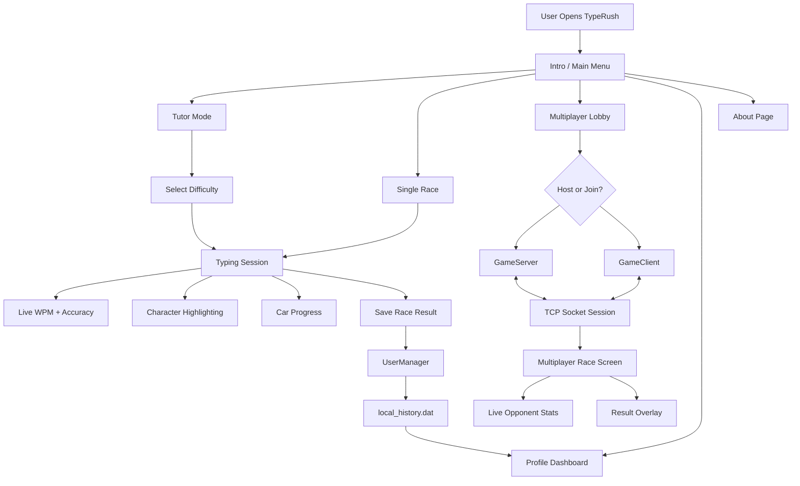
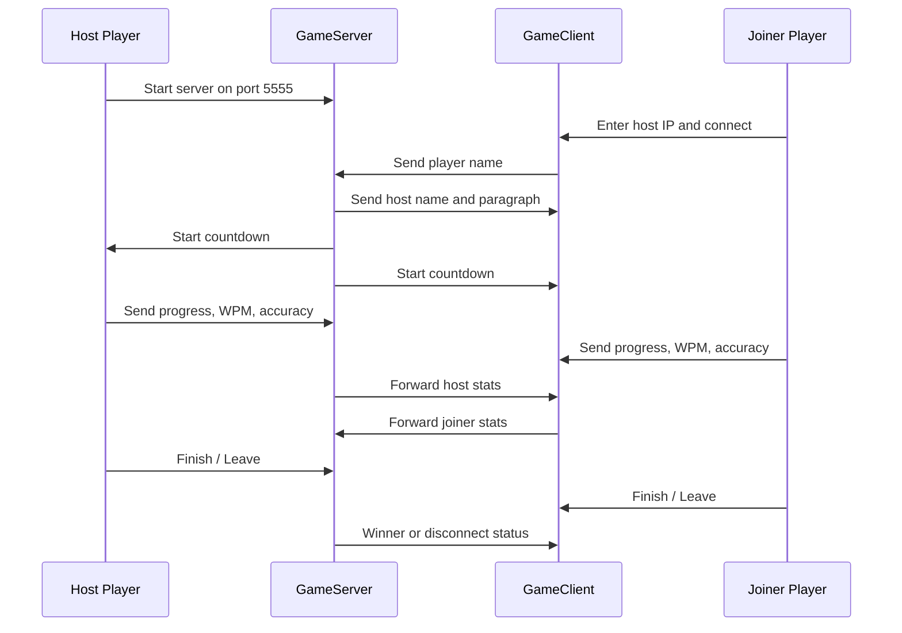

<div align="center">


<br/>

[](https://openjdk.org/)
[](https://openjfx.io/)
[](https://maven.apache.org/)
[](#multiplayer-guide)
[](#quick-start)

<h3>⌨️ A fast, competitive, desktop typing game for improving speed, accuracy, rhythm, and consistency.</h3>

<p>
  <a href="#-quick-start"><strong>Quick Start</strong></a> ·
  <a href="#-features"><strong>Features</strong></a> ·
  <a href="#-game-modes"><strong>Game Modes</strong></a> ·
  <a href="#-multiplayer-guide"><strong>Multiplayer</strong></a> ·
  <a href="#-project-architecture"><strong>Architecture</strong></a>
</p>

</div>

---

## 📌 Table of Contents

- [Overview](#-overview)
- [Preview](#-preview)
- [Features](#-features)
- [Game Modes](#-game-modes)
- [Tech Stack](#-tech-stack)
- [Project Architecture](#-project-architecture)
- [Quick Start](#-quick-start)
- [Run From Source](#-run-from-source)
- [Build Windows EXE](#-build-windows-exe)
- [Multiplayer Guide](#-multiplayer-guide)
- [Project Structure](#-project-structure)
- [Troubleshooting](#-troubleshooting)
- [Roadmap](#-roadmap)
- [License](#-license)
- [Credits](#-credits)

---

## 🎯 Overview

**TypeRush** is a **JavaFX desktop typing game** that combines two ideas in one application:

<table>
<tr>
<td width="50%">

### 🧑‍🏫 Typing Tutor
Practice with guided lessons, difficulty levels, hand-position hints, accuracy feedback, and typing tips.

</td>
<td width="50%">

### 🏎️ Type Racer
Compete in real-time typing races with live progress cars, WPM tracking, accuracy tracking, countdowns, and winner/loser results.

</td>
</tr>
</table>

The goal is simple: **type faster, make fewer mistakes, and track your improvement over time.**

---

## 🖼️ Preview

> Add your screenshots inside `docs/screenshots/` and rename them as shown below.  
> After adding images, this section will become a beautiful visual gallery on GitHub.

<table>
<tr>
<td align="center" width="50%">

<br/>
<b>Main Menu</b>
</td>
<td align="center" width="50%">

<br/>
<b>Typing Race</b>
</td>
</tr>
<tr>
<td align="center" width="50%">

<br/>
<b>Multiplayer Match</b>
</td>
<td align="center" width="50%">

<br/>
<b>Profile Analytics</b>
</td>
</tr>
</table>

---

## ✨ Features

<table>
<tr>
<td width="33%">

### ⚡ Real-Time Typing Stats
- Live **WPM**
- Live **accuracy**
- Correct/wrong character highlighting
- Progress-based car movement

</td>
<td width="33%">

### 🏁 Racing Experience
- Animated race track
- Car movement by typing progress
- Finish sound effect
- Instant result feedback

</td>
<td width="33%">

### 🌐 Multiplayer
- Host a race
- Join by IP address
- Live opponent progress
- Winner/loser overlay
- Countdown before match

</td>
</tr>
<tr>
<td width="33%">

### 🧠 Tutor Mode
- Beginner level
- Intermediate level
- Pro level
- Hand guide images
- Helpful typing tips

</td>
<td width="33%">

### 🔥 Combo System
- Rewards accurate streaks
- Combo multiplier animation
- Sound feedback for correct/wrong keys
- Accuracy-first gameplay

</td>
<td width="33%">

### 📊 Profile Dashboard
- All-time stats
- Today's stats
- History table
- WPM graph
- Accuracy graph
- Activity grid

</td>
</tr>
</table>

---

## 🎮 Game Modes

| Mode | Purpose | Best For |
|---|---|---|
| 🧑‍🏫 **Tutor Mode** | Practice typing with difficulty-based lessons | Beginners and learners |
| 🏎️ **Single Race** | Race alone with live stats and car progress | Speed practice |
| 🌐 **Multiplayer Race** | Compete against another player on the same network | Friendly competition |
| 📊 **Profile / History** | Review previous sessions and performance trends | Long-term improvement |

---

## 🧮 Performance Metrics

TypeRush tracks typing performance using common typing-game measurements:

| Metric | Meaning |
|---|---|
| **WPM** | Words per minute, based on typed correct characters |
| **Accuracy** | Percentage of correct keystrokes compared to total keystrokes |
| **Progress** | Correctly typed text divided by total text length |
| **Session Time** | Time taken to complete a race or practice session |
| **History** | Saved local race results for profile analytics |

---

## 🧰 Tech Stack

| Layer | Technology |
|---|---|
| **Language** | Java 17 |
| **UI Framework** | JavaFX |
| **UI Layout** | FXML |
| **Styling** | CSS |
| **Networking** | Java TCP/IP Sockets |
| **Build Tool** | Maven / Maven Wrapper |
| **Media** | JavaFX Media |
| **Packaging** | Maven Shade Plugin, `jpackage`, WiX Toolset |
| **Data Storage** | Local serialized history file |

---

## 🏗️ Project Architecture



---

## 🌐 Multiplayer Data Flow



---

## 🚀 Quick Start

### ✅ Option 1: Download Release — No Java Required

1. Go to the **[Latest Release](https://github.com/sajibmrbitz/TYPERUSH/releases/latest)** page.
2. Download `TypeRush_Release.zip`.
3. Extract the ZIP file anywhere on your Windows PC.
4. Open the extracted folder.
5. Double-click:

```text
TypeRush.exe
```

> The release build is bundled with its own runtime, so normal players do not need to install Java separately.

---

## 🧑‍💻 Run From Source

### Prerequisites

Make sure these are installed:

- **JDK 17 or higher**
- **Git**
- Internet connection for Maven dependencies

### Clone the Repository

```bash
git clone https://github.com/sajibmrbitz/TYPERUSH.git
cd TYPERUSH
```

### Run with Maven Wrapper

#### Windows

```bash
mvnw.cmd clean javafx:run
```

#### Linux / macOS

```bash
./mvnw clean javafx:run
```

### Run with Installed Maven

```bash
mvn clean javafx:run
```

---

## 📦 Build Windows EXE

This section is for developers who want to create a Windows installer manually.

### Requirements

| Tool | Purpose |
|---|---|
| **JDK 17+** | Required for Java compilation and `jpackage` |
| **Maven 3.8+** | Build automation |
| **WiX Toolset v3** | Required by `jpackage` for Windows `.exe` installer creation |

### Step 1: Package the Project

```bash
mvn clean package
```

### Step 2: Add jpackage Plugin

Add this plugin inside the `<plugins>` section of your `pom.xml` if it is not already present:

```xml
<plugin>
    <groupId>org.panteleyev</groupId>
    <artifactId>jpackage-maven-plugin</artifactId>
    <version>1.6.0</version>
    <configuration>
        <name>TypeRush</name>
        <appVersion>1.0.0</appVersion>
        <vendor>Sajib</vendor>
        <mainClass>com.example.TYPERUSH.Launcher</mainClass>
        <mainJar>TYPERUSH-1.0-SNAPSHOT.jar</mainJar>
        <type>EXE</type>
        <winDirChooser>true</winDirChooser>
        <winShortcut>true</winShortcut>
        <winMenu>true</winMenu>
        <destination>target/installer</destination>
    </configuration>
</plugin>
```

> ⚠️ If Maven generates a different JAR name inside `target/`, update `<mainJar>` accordingly.

### Step 3: Generate Installer

```bash
mvn jpackage:jpackage
```

### Step 4: Install

Open:

```text
target/installer/
```

Then run the generated installer:

```text
TypeRush-1.0.0.exe
```

---

## 🌐 Multiplayer Guide

TypeRush multiplayer is based on **TCP socket communication**, so both players should usually be on the **same Wi-Fi / LAN**.

### Host Player

1. Open TypeRush.
2. Go to **Multiplayer**.
3. Choose **Host**.
4. Share your local IPv4 address with the second player.

### Join Player

1. Open TypeRush.
2. Go to **Multiplayer**.
3. Choose **Join**.
4. Enter the host's IPv4 address.
5. Start racing when the countdown begins.

### Network Details

| Setting | Value |
|---|---|
| Protocol | TCP |
| Default Port | `5555` |
| Recommended Network | Same Wi-Fi / LAN |
| Firewall | Allow Java / TypeRush if Windows blocks the connection |

### How to Find IPv4 Address on Windows

```bash
ipconfig
```

Look for:

```text
IPv4 Address
```

Example:

```text
192.168.0.105
```

---

## 📁 Project Structure

```text
TYPERUSH/
├── .mvn/
│   └── wrapper/                         # Maven wrapper files
├── src/
│   └── main/
│       ├── java/com/example/TYPERUSH/
│       │   ├── BaseController.java
│       │   ├── GameClient.java          # Multiplayer client socket
│       │   ├── GameController.java      # Tutor + single race logic
│       │   ├── GameServer.java          # Multiplayer host socket
│       │   ├── GameSession.java         # Shared multiplayer state
│       │   ├── Launcher.java            # Application launcher
│       │   ├── MenuController.java
│       │   ├── MultiplayerController.java
│       │   ├── MultiplayerGameController.java
│       │   ├── ProfileController.java   # Dashboard + charts
│       │   ├── RaceResult.java          # Race result model
│       │   ├── SoundManager.java
│       │   ├── TutorLevelController.java
│       │   └── UserManager.java         # Local history persistence
│       └── resources/com/example/TYPERUSH/
│           ├── hands/                   # Hand guide images
│           ├── sounds/                  # Game sound effects
│           ├── *.fxml                   # JavaFX UI screens
│           ├── style.css                # Application styling
│           └── car.png                  # Race car asset
├── pom.xml                              # Maven configuration
├── mvnw
├── mvnw.cmd
└── README.md
```

---

## 🧩 Main Screens

| Screen | Description |
|---|---|
| **Intro Screen** | Entry screen for the application |
| **Main Menu** | Navigation hub for tutor, race, multiplayer, profile, and about pages |
| **Tutor Level Screen** | Select Beginner, Intermediate, or Pro |
| **Typing Session** | Main typing practice/racing interface |
| **Multiplayer Setup** | Host or join a network race |
| **Multiplayer Race** | Live two-player race interface |
| **Profile Dashboard** | Stats, history table, activity grid, WPM/accuracy graphs |
| **About Page** | Project and author information |

---

## 🛠️ Troubleshooting

### `javafx:run` does not work

Check your JDK version:

```bash
java -version
```

Make sure it is **JDK 17 or higher**.

---

### Maven command not found

Use the Maven wrapper:

```bash
mvnw.cmd clean javafx:run
```

or on Linux/macOS:

```bash
./mvnw clean javafx:run
```

---

### Multiplayer cannot connect

Try these fixes:

- Make sure both players are on the same Wi-Fi.
- Make sure the joiner entered the host IPv4 address correctly.
- Allow Java or TypeRush through Windows Firewall.
- Confirm port `5555` is not blocked.
- Restart both applications and try again.

---

### EXE build fails

Check the following:

- WiX Toolset v3 is installed.
- WiX is available in system PATH.
- You restarted your terminal after installing WiX.
- The `<mainJar>` name in the jpackage plugin matches the actual JAR in `target/`.

---

## 🧭 Roadmap

Potential future improvements:

- [ ] Online matchmaking
- [ ] Custom paragraph input
- [ ] More typing lesson packs
- [ ] Global leaderboard
- [ ] Dark/light theme toggle
- [ ] Export typing history as CSV
- [ ] More multiplayer rooms
- [ ] Linux/macOS release builds

---

## 🤝 Contributing

Contributions are welcome for learning, bug fixing, and improving the game.

```bash
# Fork the repository
# Create a new branch
git checkout -b feature/your-feature-name

# Commit changes
git commit -m "Add your feature"

# Push branch
git push origin feature/your-feature-name
```

Then open a pull request from your fork.

---

## 📜 License

This project was developed as an academic project at **BUET** and is free for educational use.

> Recommended: add a dedicated `LICENSE` file to make reuse permissions clearer for other developers.

---

## 👨‍💻 Credits

<div align="center">

Made with ❤️ using **Java**, **JavaFX**, **Maven**, and **Socket Programming**

**Repository:** [sajibmrbitz/TYPERUSH](https://github.com/sajibmrbitz/TYPERUSH)

<br/>


</div>
